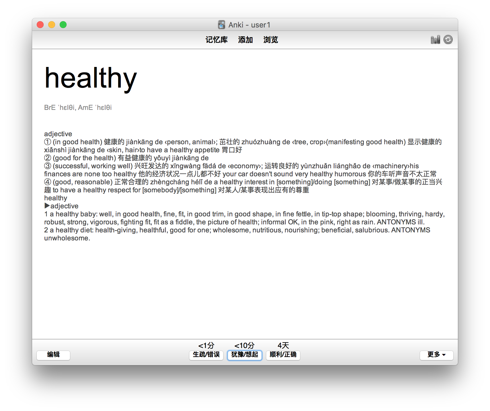
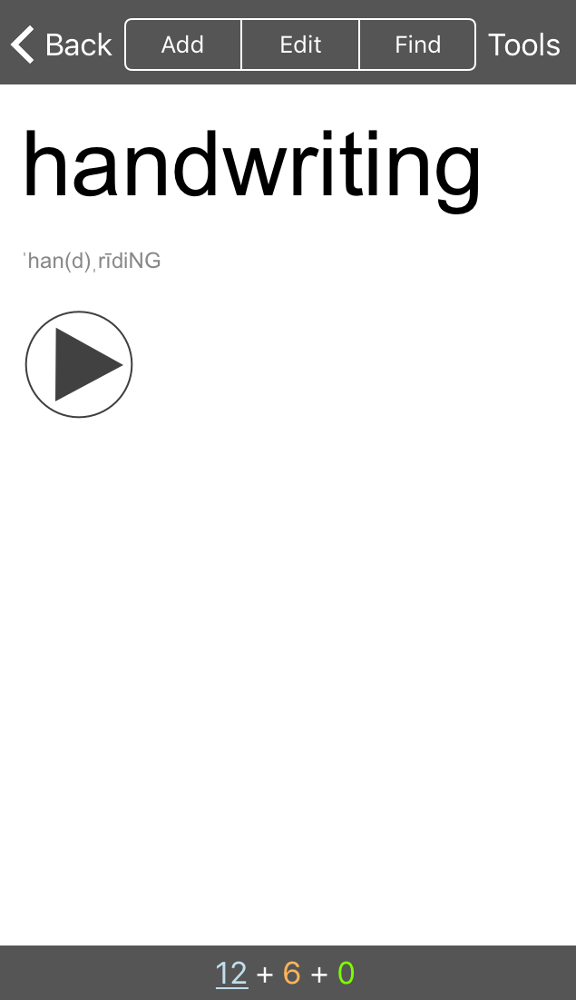
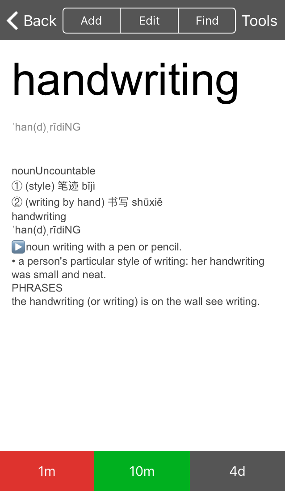

## anki-macmillan7000-v0.1.apkg

* 从[从github下载 anki-macmillan7000-v0.1.apkg](https://github.com/jiahualong/anki-macmillan7000-libray/releases)
* 或[从ankiweb下载] (https://ankiweb.net/shared/info/42529606)
* 下载后导入anki即可使用

## Mac Anki 示例

## iPhone Anki 示例
<!---->

## 参考链接
* [赛门喵麦克米伦7000高频词记忆卡](https://zhuanlan.zhihu.com/p/27063304)
* [macmillandictionary](http://www.macmillandictionary.com)
* [zh_CN 简体中文词典](http://download.huzheng.org/zh_CN/)
* [苹果Mac自带词典完美扩充](http://www.jianshu.com/p/c57be986589b)
* [Urinx dict](https://github.com/Urinx/dict)
* [DictUnifier](https://github.com/jjgod/mac-dictionary-kit/)

